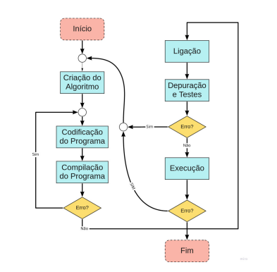
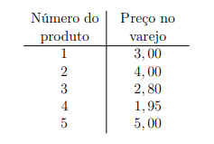
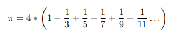

# Algoritmos e Estrutura de Dados 2 - Lista de atividade para prática da Linguagem C

## Introdução

Para a resolução de todas as questões dessa lista será utilizando a metodologia apresentada no diagrama da figura:

## Conteúdo

Os conceitos explorados nessa lista de exercício são:

- Declaração e manipulação de variáveis;
- Condicionais
- Estrutura de Repetição
- Array: Vetores e Matrizes
- Tipos de Dados Compostos
- Funções
- Recursividade

## Problemas a serem resolvidos

O código de cada um dos problemas está na pasta principal do repositório, com o tipo do arquivo .c (Exemplo: problema1.c, problema2.c).

### Problema 1:
Escreva um programa para somar uma sequência de inteiros e
calcular sua média. Suponha que o primeiro inteiro lido com scanf especifique
o número de valores a serem inseridos. Seu programa deve ler apenas um
valor cada vez que scanf é executado. Uma sequência de entrada típica pode
ser:

7 678 234 315 489 536 456 367

### Problema 2:
Escreva um programa que converta temperaturas de 30 oC a
50 oC para a escala Fahrenheit espaçados de 1
oC. O programa deve imprimir
uma tabela exibindo as temperaturas nas duas escalas lado a lado. [Dica:
F = C + 32]

### Problema 3:
Escreva um programa para calcular e imprimir a soma de todos
os múltiplos de 7 partindo de 1 até 100.

### Problema 4:
Escreva um programa para calcular e imprimir uma lista de
todos os números primos de 1 a 100.

### Problema 5: 
Escreva um programa que imprima a soma, a soma dos quadrados e a soma dos cubos de todos os números naturais de 1 até qualquer
número inserido pelo usuário.

### Problema 6:
A função fatorial é freqüentemente usada em problemas de
probabilidade. O fatorial é igual ao produto dos inteiros positivos de 1 a n.
Escreva um programa que avalie os fatoriais dos inteiros de 1 a n. Imprima
os resultados em formato tabular.

### Problema 7:
Uma aplicação interessante de computadores é desenhar gráficos e gráficos de barras. Escreva um programa que leia cinco números (cada um entre 1 e 30). Para cada número lido, seu programa deve imprimir uma linha contendo aquele número de asteriscos adjacentes. Por exemplo, se seu
programa lê o número sete, ele deve imprimir ∗ ∗ ∗ ∗ ∗ ∗ ∗.

### Problema 8:
Um varejista online vende cinco produtos diferentes, cujos preços de varejo são mostrados na tabela a seguir:

### Problema 9:
Escreva um programa para converter e imprimir os caracteres
para os valores ASCII de 0 a 127. O programa deve imprimir 10 caracteres
por linha.

### Problema 10:
Calcule o valor de π da série infinita: 

### Problema 11:
Um triângulo retângulo pode ter lados inteiros. O conjunto
de três valores inteiros para os lados de um triângulo retângulo é chamado
de triplo pitagórico. Esses três lados devem satisfazer a relação de que a
soma dos quadrados de dois dos lados é igual ao quadrado da hipotenusa.
Encontre todos os triplos pitagóricos para cateto1, cateto2 e a hipotenusa,
todos com até o valor de n, indicado como parâmetro.

### Problema 12:
Escreva um programa que imprima uma tabela de todos os
equivalentes de algarismos romanos dos números decimais no intervalo de 1
a 100.

### Problema 13:
Determine o dia da semana para qualquer data compreendida
entre 0 DC até 2 de março de 2022. Exemplo de execução:

Entra como valor de entrada via *scanf* três numerais:
- 2 de março de 2022
- Wednesday

### Problema 14:
Defina uma função chamada hipotenusa que calcula o comprimento da hipotenusa de um triângulo retângulo quando os outros dois
lados são dados.

### Problema 15:
Escreva uma função que exibe um retângulo sólido de asteriscos cujos lados são especificados nos parâmetros inteiros lado1 e lado2. Por
exemplo, se os lados são 4 e 5, a função exibe o seguinte:
∗ ∗ ∗ ∗ ∗
∗ ∗ ∗ ∗ ∗
∗ ∗ ∗ ∗ ∗
∗ ∗ ∗ ∗ ∗

### Problema 16:
Escreva a função anterior e passe como parâmetro o caractere
que deseja imprimir.

### Problema 17:
Escreva uma função que considere o tempo como três argumentos inteiros (para horas, minutos e segundos) e retorne o número de
segundos desde a última vez que o relógio bateu 12. Use esta função para calcular a quantidade de tempo em segundos entre dois tempos, ambos dentro
de um ciclo de 12 horas do relógio.

### Problema 18:
Um número inteiro é considerado um número perfeito se seus
fatores, incluindo 1 (mas não o próprio número), somam o número. Por
exemplo, 6 é um número perfeito porque 6 = 1 + 2 + 3. Escreva uma função
isPerfect que determina se o número do parâmetro é um número perfeito.
Use esta função em um programa que determina e imprime todos os números
perfeitos entre 1 e 1000. Imprima os fatores de cada número perfeito para
confirmar que o número é realmente perfeito.

### Problema 19:
Escreva dois programas que recebem como parâmetro três
inteiros representando os coeficientes de uma função do segundo grau e execute:
a) O teste para saber se essa função tem raízes reais;
b) O valor das raízes reais.

### Problema 20:
Escreva uma função que receba um inteiro e retorne a soma
de seus dígitos. Por exemplo, dado o número 7631, a função deve retornar
17.

## Funções recursivas

### Problema 21:
Escreva funções recurivas para calcular:
- a) Máximo Divisor Comum entre dois número inteiros;
- b) Fatorial de um número natural;
- c) A série de fibonacci (1, 1, 2, 3, 5..., a, b,(a + b). . .);
- d) isPrime(n): Verificador recursivo se n é um número natural primo.

### Problema 22:
Defina uma função recursiva que, dado os valores inteiros de
x1 e x2, determine y = x1x2.

### Problema 23:
Função para inverter um número. Exemplo: f(1234) = 4321

### Problema 24:
Somatório de valores de 1 até N.

### Problema 25:
Implemente a seguinte função matemática f(m, n) definida
por partes:

1. f(m, n) = m + 1, se n = 1.
2. f(m, n) = n + 1, se m = 1.
3. f(m, n) = f(m, n − 1) + f(m − 1, n), se m > 1, n > 1.

### Problema 26:
Defina a recursivamente a Função de Ackermann A(m,n):

1. n + 1, se m = 0.
2. A(m − 1, 1), se m > 0, n = 0.
3. A(m − 1, A(m, n − 1)), se m > 0, n > 0.
